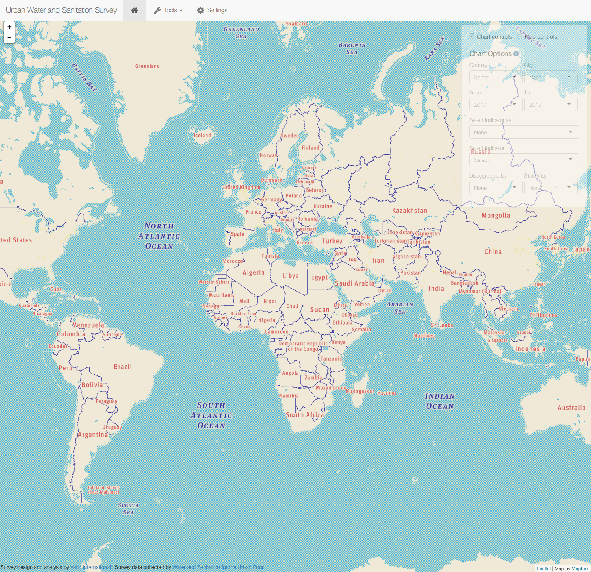

```{r setup, include=FALSE}
knitr::opts_chunk$set(echo = TRUE)
```

&nbsp;

<a href="https://validmeasures.io/wsup"></a>

## Urban Water and Sanitation Survey
In order to measure sustained universal coverage in urban areas of [Water and Sanitation for the Urban Poor (WSUP)](https://www.wsup.com) programme countries, WSUP conducted citywide surveys in one selected city in each of six programme countries in 2017. These citywide surveys collected data allowing service levels across the entire city to be characterised, while also allowing more detailed data to be collected in areas of the city of particular interest to WSUP. These surveys were intended to generate useful information for others working in the sector including the municipality, regulator and local utilities.


