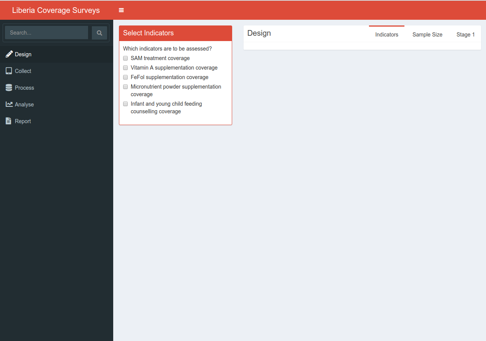

# liberiaCoverage: A Shiny web application to support the implementation of health and nutrition coverage surveys in Liberia

This is a [Shiny](https://shiny.rstudio.com/) web application designed and developed during the **Coverage Assessment of Direct Nutrition Interventions** implemented in September 2018 by the [Liberia Institute of Statistics and Geo-Information Services](https://www.lisgis.net/) with technical support from UNICEF Liberia and [Valid International](http://www.validinternational.org). This web application aims to support the implementation of health and nutrition coverage surveys in Liberia from sampling to data collection to analysis.

## Installation

This web application is not yet launched online and can only be accessed locally using a computer with [R](https://cran.r-project.org/) installed. To install [R](https://cran.r-project.org/), see instructions [here](https://cran.r-project.org/).

Once R is installed in your computer, download a copy of the `liberiaCoverage` web app by cloning or downloading from this GitHub repository.

## Usage

To run the `liberiaCoverage` app:

1. Open [R](https://cran.r-project.org/).

2. Install the required [R](https://cran.r-project.org/) package called `shiny`. This can be done by issuing the following commands in [R](https://cran.r-project.org/):

```r
install.pacakges("shiny")
```

3. In [R](https://cran.r-project.org/), change the working directory to the directory in your computer where you saved / that contains the `liberiaCoverage` clone/download. This can be done through the following command in [R](https://cran.r-project.org/):

```r
setwd("path/to/directory/containing/liberiaCoverage")
```

4. Once the working directory has been set to where the `liberiaCoverage` app is, the web app can now be run by issuing the following command in [R](https://cran.r-project.org/):

```r
shiny::runApp()
```

A web browser page will come up and the web application will be shown.


